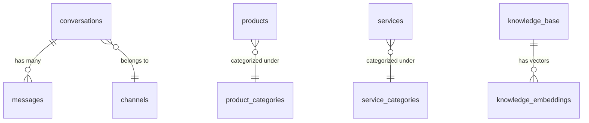

# 🏛️ Arsitektur Database & Struktur Data Chatbot AI (Production-Ready)

Dokumen ini menyajikan rancangan basis data tingkat produksi (*production-ready*) untuk sistem Chatbot AI. Rancangan ini dilengkapi dengan skema relasional, dukungan **Pencarian Semantik (RAG)** menggunakan *Vector Embeddings*, serta kolom fleksibel (**JSONB**) agar siap diintegrasikan dengan multi-channel (WhatsApp, Instagram, Webchat).

---

## 📊 1. Entity Relationship Diagram (ERD)

Diagram di bawah ini menggambarkan bagaimana setiap entitas data terhubung dalam sistem chatbot:



---

## 🛠️ 2. PostgreSQL / Supabase DDL (Skema SQL Tabel)

Berikut adalah DDL SQL siap pakai yang dirancang dengan indeks performa tinggi, foreign key constraint, dan optimasi query.

```sql
-- Aktifkan ekstensi UUID dan Vector (untuk RAG Semantic Search)
CREATE EXTENSION IF NOT EXISTS "uuid-ossp";
CREATE EXTENSION IF NOT EXISTS "vector";

-- 1. TABEL CONVERSATIONS (Sesi Obrolan Pelanggan)
CREATE TABLE conversations (
    id UUID PRIMARY KEY DEFAULT uuid_generate_v4(),
    customer_id VARCHAR(100) NOT NULL, -- ID unik dari platform (misal: nomor WA atau ID IG)
    customer_name VARCHAR(150) NOT NULL,
    channel VARCHAR(50) NOT NULL, -- 'WhatsApp', 'Instagram', 'Webchat'
    status VARCHAR(30) NOT NULL DEFAULT 'ai_active', -- 'ai_active', 'ai_paused', 'assigned_to_admin', 'resolved'
    unread_count INT NOT NULL DEFAULT 0,
    metadata JSONB DEFAULT '{}'::jsonb, -- Untuk data fleksibel (tipe device, OS, label kustom)
    created_at TIMESTAMP WITH TIME ZONE DEFAULT CURRENT_TIMESTAMP,
    updated_at TIMESTAMP WITH TIME ZONE DEFAULT CURRENT_TIMESTAMP
);

-- Indeks untuk mempercepat pencarian sesi aktif berdasarkan ID pelanggan & channel
CREATE UNIQUE INDEX idx_conversations_customer_channel ON conversations(customer_id, channel);

-- 2. TABEL MESSAGES (Detail Isi Chat Inbound & Outbound)
CREATE TABLE messages (
    id UUID PRIMARY KEY DEFAULT uuid_generate_v4(),
    conversation_id UUID NOT NULL REFERENCES conversations(id) ON DELETE CASCADE,
    sender VARCHAR(30) NOT NULL, -- 'customer', 'ai', 'admin', 'system'
    text TEXT,
    media_url TEXT,
    media_metadata JSONB DEFAULT '{}'::jsonb, -- Menyimpan mimetype, size, durasi video
    status VARCHAR(20) NOT NULL DEFAULT 'sent', -- 'sent', 'delivered', 'read', 'failed'
    metadata JSONB DEFAULT '{}'::jsonb, -- Menyimpan info tambahan (ID pesan dari WhatsApp API, dll)
    created_at TIMESTAMP WITH TIME ZONE DEFAULT CURRENT_TIMESTAMP
);

CREATE INDEX idx_messages_conversation_id ON messages(conversation_id);

-- 3. TABEL KNOWLEDGE BASE (Pusat Pengetahuan FAQ + Vector)
CREATE TABLE knowledge_base (
    id UUID PRIMARY KEY DEFAULT uuid_generate_v4(),
    category VARCHAR(50) NOT NULL,
    question TEXT NOT NULL,
    answer TEXT NOT NULL,
    keywords TEXT[] DEFAULT '{}'::text[], -- Kata kunci pencarian cepat (exact match)
    embedding VECTOR(1536), -- Vector 1536-dimensi untuk OpenAI Embeddings (text-embedding-3-small)
    is_active BOOLEAN NOT NULL DEFAULT TRUE,
    created_at TIMESTAMP WITH TIME ZONE DEFAULT CURRENT_TIMESTAMP,
    updated_at TIMESTAMP WITH TIME ZONE DEFAULT CURRENT_TIMESTAMP
);

-- Indeks HNSW untuk pencarian vektor cepat (Semantic Search)
CREATE INDEX idx_knowledge_embedding ON knowledge_base USING hnsw (embedding vector_cosine_ops);

-- 4. TABEL SAFETY RULES (Filter Kata Kunci Kritis / Guardrails)
CREATE TABLE safety_rules (
    id SERIAL PRIMARY KEY,
    keyword VARCHAR(100) UNIQUE NOT NULL,
    category VARCHAR(50) NOT NULL, -- 'finance', 'complaint', 'spam', 'harassment'
    action VARCHAR(50) NOT NULL DEFAULT 'handoff_to_admin', -- 'handoff_to_admin', 'ignore', 'block'
    response_message TEXT NOT NULL,
    is_active BOOLEAN DEFAULT TRUE
);

CREATE INDEX idx_safety_rules_keyword ON safety_rules(keyword);

-- 5. TABEL PRODUCTS (Katalog Suku Cadang & Sparepart)
CREATE TABLE products (
    id VARCHAR(50) PRIMARY KEY, -- ID kustom (contoh: 'prod_01')
    name VARCHAR(255) NOT NULL,
    sku VARCHAR(100) UNIQUE NOT NULL,
    category VARCHAR(100) NOT NULL,
    brand VARCHAR(100),
    price DECIMAL(12, 2) NOT NULL DEFAULT 0.00,
    stock INT NOT NULL DEFAULT 0,
    compatibility TEXT[], -- Array tipe motor yang kompatibel
    description TEXT,
    status VARCHAR(30) NOT NULL DEFAULT 'active', -- 'active', 'out_of_stock', 'draft'
    source VARCHAR(50) DEFAULT 'postgresql', -- 'postgresql', 'google_sheets'
    metadata JSONB DEFAULT '{}'::jsonb, -- data spesifik sparepart (garansi, dll)
    created_at TIMESTAMP WITH TIME ZONE DEFAULT CURRENT_TIMESTAMP,
    updated_at TIMESTAMP WITH TIME ZONE DEFAULT CURRENT_TIMESTAMP
);

-- 6. TABEL SERVICES (Katalog Jasa & Paket Bengkel)
CREATE TABLE services (
    id VARCHAR(50) PRIMARY KEY, -- ID kustom (contoh: 'svc_01')
    name VARCHAR(255) NOT NULL,
    category VARCHAR(100) NOT NULL,
    price_start DECIMAL(12, 2) NOT NULL DEFAULT 0.00,
    price_end DECIMAL(12, 2), -- Null jika harga jasa bersifat flat
    duration_minutes INT NOT NULL DEFAULT 30,
    description TEXT,
    status VARCHAR(30) NOT NULL DEFAULT 'active', -- 'active', 'draft'
    source VARCHAR(50) DEFAULT 'postgresql',
    metadata JSONB DEFAULT '{}'::jsonb,
    created_at TIMESTAMP WITH TIME ZONE DEFAULT CURRENT_TIMESTAMP,
    updated_at TIMESTAMP WITH TIME ZONE DEFAULT CURRENT_TIMESTAMP
);
