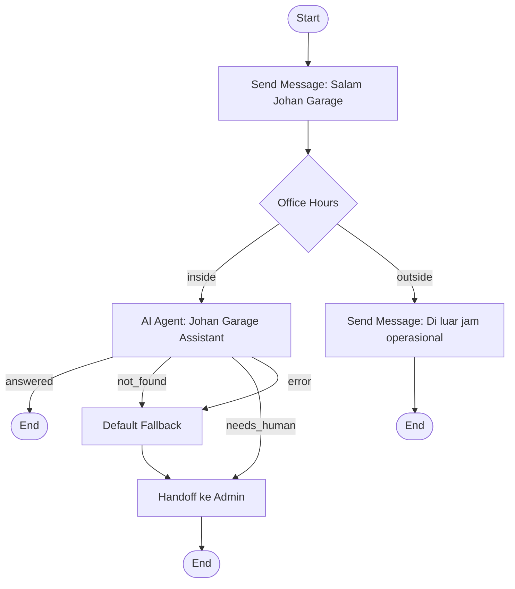

# Conversation Flow Builder

Status: Implementation blueprint
Project: `D:\Project Apk-Web\chatbotAI`
Target route: `/automation/conversations/[flowId]`
Stack: Next.js App Router, React, TypeScript, Tailwind CSS, Supabase with Blob fallback

## 1. Tujuan

Membuat fitur Conversation menjadi visual flow builder yang dapat diedit seperti referensi gambar. Admin dapat menyusun alur chatbot dengan node dan cabang, menyimpan perubahan sebagai Draft, menguji alur dalam sandbox, lalu Publish setelah alur valid.

Hasil akhirnya harus terhubung langsung dengan:

- Conversations dan riwayat pelanggan.
- AI Agents yang berstatus Active.
- Knowledge Base, termasuk FAQ, dokumen, URL, Google Sheet, dan Text Content.
- Custom Instructions global dan prompt khusus AI Agent.
- Chatbot Settings, channel settings, office hours, handoff, dan spam guard.

Prinsip utama:

- Draft tidak boleh memengaruhi chatbot produksi.
- Hanya versi Published yang boleh menangani pesan pelanggan.
- Preview tidak boleh mengirim pesan ke WhatsApp, Instagram, atau API eksternal sungguhan.
- AI Agent tetap wajib memprioritaskan Knowledge Base dan tidak boleh mengarang data bisnis penting.
- Satu percakapan pelanggan tidak boleh tercampur dengan percakapan pelanggan lain.

## 2. Kondisi Sistem Saat Ini

Conversation Flow saat ini masih berupa konfigurasi datar:

- Nama flow.
- Channel.
- Satu trigger.
- Initial message.
- Interactive menu.
- Fallback message.
- Satu AI Agent.
- Satu aturan handoff.
- Status Draft, Published, atau Inactive.

Runtime saat ini memilih flow Published berdasarkan channel dan trigger melalui `automation-orchestrator.ts`. Model ini harus tetap didukung selama migrasi agar flow lama tidak rusak.

Kesenjangan yang harus diperbaiki:

- Belum ada canvas drag-and-drop.
- Belum ada node dan edge yang benar-benar dapat ditambah, dipindah, dihubungkan, atau dihapus.
- Belum ada versioning Draft dan Published yang terpisah.
- Belum ada simulator end-to-end sebelum Publish.
- Belum ada validasi graph, rollback, dan audit publish.
- Tampilan visual saat ini hanya representasi form, bukan graph editor.

## 3. Keputusan Produk

### 3.1 Status Flow

Setiap flow memiliki status berikut:

- `Draft`: sedang diedit dan belum digunakan runtime.
- `Published`: versi aktif yang digunakan chatbot.
- `Inactive`: flow tidak dijalankan, tetapi versi dan riwayatnya tetap disimpan.

Flow yang sudah Published tetap boleh memiliki Draft baru. Runtime terus memakai published revision terakhir sampai Draft baru berhasil diuji dan dipublish.

### 3.2 Aturan Draft dan Publish

- Perubahan canvas disimpan otomatis sebagai Draft dengan debounce 800 ms.
- Tombol `Save Draft` tetap tersedia untuk penyimpanan manual.
- Tombol `Discard Changes` mengembalikan Draft ke published revision terakhir setelah konfirmasi.
- Tombol `Test Flow` membuka Preview Conversation.
- Tombol `Publish` hanya aktif jika validasi graph lulus.
- Publish membuat revision immutable baru.
- Revision sebelumnya dapat dipulihkan melalui menu Version History.

### 3.3 Prioritas Runtime

Urutan pemrosesan pesan masuk:

1. Validasi channel, akun, status channel, spam guard, dan blacklist.
2. Cari flow Published yang cocok dengan channel dan trigger.
3. Jalankan graph mulai dari Start node.
4. Jalankan node condition dan action sampai mencapai node yang menunggu input atau End.
5. Jika masuk AI Agent node, gunakan AI Agent aktif, seluruh Knowledge Base aktif, Custom Instructions, dan konteks Conversation pelanggan yang sama.
6. Jika graph gagal atau tidak memiliki jalur valid, jalankan Default Fallback atau handoff ke admin.
7. Simpan node terakhir dan execution state pada Conversation agar pesan berikutnya melanjutkan alur yang benar.

## 4. User Experience

### 4.1 Halaman Daftar Conversations

Route: `/automation`

Fitur:

- Daftar flow dengan nama, channel, revision aktif, jumlah respons, last edited, status, dan health.
- Tombol `Create Conversation`.
- Aksi `Edit`, `Test`, `Duplicate`, `Publish/Deactivate`, `Version History`, dan `Delete`.
- Badge peringatan jika AI Agent yang dipakai sudah Inactive atau Knowledge Base kosong.
- Pencarian dan filter channel/status.

Klik nama atau Edit membuka visual builder, bukan modal besar.

### 4.2 Layout Visual Builder

Desktop menggunakan layout penuh:

- Header: breadcrumb, nama flow, status Draft/Published, last saved, Discard, Test Flow, dan Publish.
- Toolbar kiri atas: quota, channel, dan AI Training/Knowledge status.
- Node palette kiri: daftar node yang dapat ditambahkan.
- Canvas tengah: node, edge, minimap, grid, pan, zoom, fit view, dan auto layout.
- Inspector kanan: form konfigurasi node yang sedang dipilih.
- Preview drawer kanan/bawah: simulasi percakapan tanpa meninggalkan canvas.
- Footer status: saving, saved, validation errors, dan revision.

Mobile dan tablet:

- Canvas tetap dapat dipan dan dizoom.
- Node palette dan inspector menjadi bottom sheet.
- Preview Conversation memakai full-screen sheet.
- Publish tetap membutuhkan validasi yang sama dengan desktop.

### 4.3 Interaksi Canvas

- Drag node dari palette ke canvas.
- Klik tombol `+` pada edge untuk menyisipkan node di tengah jalur.
- Hubungkan output handle ke input handle.
- Drag node untuk mengatur posisi.
- Multi-select dan delete dengan konfirmasi untuk node yang memiliki child.
- Undo dan redo minimal 50 perubahan lokal.
- Copy, paste, duplicate, dan keyboard delete.
- Zoom 25% sampai 200%.
- Fit view dan auto layout vertikal/horizontal.
- Node yang invalid memiliki border merah dan pesan error.
- Edge condition menampilkan label seperti `Ya`, `Tidak`, `Office Hour`, atau `Outside Hour`.

Implementasi canvas direkomendasikan memakai `@xyflow/react` karena mendukung custom nodes, handles, edges, connection validation, pan, zoom, dan viewport. Node editor harus memakai custom node components agar visualnya konsisten dengan dashboard Johan Garage.

## 5. Katalog Node

### 5.1 Node MVP

| Node               | Fungsi                                                                                  | Output                                          |
| ------------------ | --------------------------------------------------------------------------------------- | ----------------------------------------------- |
| Start              | Titik masuk flow. Hanya boleh satu.                                                     | Satu jalur                                      |
| Send Message       | Mengirim teks atau template ke pelanggan.                                               | Satu jalur                                      |
| Office Hours       | Mengecek workspace timezone dan jam operasional.                                        | `inside`, `outside`                             |
| Keyword Condition  | Mencocokkan kata/frasa dari pesan pelanggan.                                            | Satu output per rule dan `else`                 |
| Menu / Quick Reply | Menampilkan pilihan dan menunggu input pelanggan.                                       | Satu output per pilihan dan `fallback`          |
| AI Agent           | Memanggil reply engine dengan Agent, KB, Custom Instructions, dan Conversation context. | `answered`, `needs_human`, `not_found`, `error` |
| Knowledge Lookup   | Mencari data langsung dari FAQ/dokumen/Sheet tanpa jawaban bebas.                       | `found`, `not_found`                            |
| Handoff            | Mengalihkan Conversation ke admin/team.                                                 | Satu jalur opsional                             |
| Set Conversation   | Mengubah tag, status, assigned team, atau priority.                                     | Satu jalur                                      |
| Default Fallback   | Balasan aman ketika tidak ada jalur atau data.                                          | Satu jalur opsional                             |
| End                | Mengakhiri execution flow.                                                              | Tidak ada output                                |

### 5.2 Node Fase Lanjutan

- Delay/Wait.
- Date and time condition.
- Customer attribute condition.
- Sentiment/risk condition.
- HTTP API action melalui API Integration yang sudah terdaftar.
- Create booking.
- Create/update ticket.
- Send media.
- Subflow.
- A/B split.

Node fase lanjutan tidak boleh menghambat MVP.

## 6. Konfigurasi Node

### Start

- Channel dan account.
- Trigger: first message, every message, keyword, outside office hours, booking intent, high risk, atau customer asks admin.
- Priority jika beberapa flow cocok.
- Trigger keywords jika diperlukan.

### Send Message

- Message body.
- Variabel: `{{customer.name}}`, `{{workspace.name}}`, `{{conversation.channel}}`, dan nilai aman lain.
- Typing delay opsional.
- Template channel jika dibutuhkan.

### Office Hours

- Default memakai `workspace.timezone` dan `workspace.businessHours`.
- Opsi override khusus flow.
- Dua output wajib: `inside` dan `outside`.

### Keyword Condition

- Match mode: contains, exact, starts with, atau regex terbatas.
- Case insensitive secara default.
- Daftar rules berurutan.
- Output `else` wajib.

### Menu / Quick Reply

- Message prompt.
- Maksimal pilihan mengikuti batas channel.
- Label pilihan dan value internal dipisahkan.
- Setiap pilihan mempunyai output handle sendiri.
- Timeout dan fallback.

### AI Agent

- Pilih AI Agent Active atau `Auto by channel`.
- Toggle penggunaan Conversation history.
- Toggle Knowledge Base wajib. Default selalu aktif.
- Confidence threshold.
- Output untuk answered, needs human, data not found, dan provider error.
- Preview menampilkan sumber jawaban, grounded status, confidence, dan Agent yang dipakai.

### Knowledge Lookup

- Search query template.
- Filter source opsional: all, FAQ, document, URL, Sheet, atau text content.
- Minimum confidence.
- `not_found` tidak boleh mengambil harga/stok/data internal dari internet.

### Handoff

- Team atau agent tujuan.
- Pesan kepada pelanggan.
- Reason dan internal note.
- Status Conversation setelah handoff.

### Set Conversation

- Add/remove tag.
- Ubah status.
- Ubah priority/risk.
- Assign team.
- Tidak boleh mengubah data pelanggan sensitif tanpa izin eksplisit.

## 7. Contoh Flow Johan Garage



Perilaku contoh:

- Pelanggan menerima greeting.
- Office Hours membagi jalur berdasarkan timezone workspace.
- Pada jam kerja, AI Agent menjawab dengan Knowledge Base dan konteks Conversation.
- Di luar jam kerja, pelanggan menerima pesan khusus.
- Data bisnis yang tidak tersedia masuk Default Fallback lalu diarahkan ke admin.

## 8. Preview Conversation

Preview harus tersedia sebelum Publish dan menggunakan Draft terbaru.

### Input Simulator

- Channel simulasi.
- Nama/nomor pelanggan dummy.
- Pesan pelanggan.
- Tanggal, jam, dan timezone simulasi.
- Status pelanggan baru atau existing.
- Conversation history dummy opsional.
- Pilihan untuk menggunakan data Knowledge Base aktif.

### Output Simulator

- Tampilan chat customer dan bot.
- Node yang sedang dijalankan disorot pada canvas.
- Execution trace berisi urutan node, edge, condition result, durasi, dan status.
- Untuk AI Agent: nama agent, source, grounded, confidence, dan fallback reason.
- Daftar perubahan Conversation yang akan terjadi, tetapi belum disimpan.
- Tombol reset dan jalankan skenario lain.

### Aturan Sandbox

- Tidak mengirim ke WhatsApp, Instagram, Website Chat publik, atau API eksternal.
- Tidak membuat Conversation pelanggan sungguhan.
- Tidak mengubah ticket, booking, customer, tag, atau handoff sungguhan.
- Tidak menambah bot response production counter.
- Boleh membaca Knowledge Base aktif dan memanggil provider AI jika admin memilih live AI test.
- Live AI test harus diberi rate limit dan label bahwa token provider dapat terpakai.
- Default test memakai deterministic mock untuk node non-AI.

## 9. Validasi Sebelum Publish

Publish ditolak jika salah satu kondisi berikut ditemukan:

- Tidak ada Start node atau Start node lebih dari satu.
- Ada node tanpa ID unik.
- Ada edge tanpa source atau target.
- Ada edge menuju node yang tidak tersedia.
- Ada node wajib yang belum dikonfigurasi.
- Ada condition output tanpa edge.
- Ada node selain End yang menjadi dead end tanpa fallback yang sah.
- Ada cycle yang tidak memiliki batas iterasi atau wait state.
- AI Agent yang dipilih tidak ada atau tidak Active.
- Channel flow tidak aktif atau tidak cocok dengan AI Agent.
- Knowledge Lookup aktif tetapi tidak ada sumber Knowledge Base siap.
- Handoff aktif tetapi target kosong.
- Tidak ada Default Fallback untuk jalur AI/data-not-found.
- Graph melebihi batas node, edge, depth, atau execution steps.

Peringatan yang masih mengizinkan Publish:

- Draft belum pernah dites.
- Flow lain pada channel dan priority yang sama berpotensi overlap.
- Custom Instructions kosong.
- Provider AI demo mode.
- Office hours workspace belum lengkap.

Dialog Publish menampilkan:

- Jumlah error dan warning.
- Revision yang akan dibuat.
- Ringkasan node/edge berubah.
- Channel terdampak.
- Tombol konfirmasi `Publish Revision`.

## 10. Data Model

Gunakan tabel khusus agar Draft, Published revision, dan audit tidak bertabrakan dengan Inbox Conversations.

### Automation Flow

```ts
type AutomationFlow = {
  id: string;
  name: string;
  channel: string;
  accountId?: string;
  status: "Draft" | "Published" | "Inactive";
  priority: number;
  draftVersionId: string;
  publishedVersionId?: string;
  createdAt: string;
  updatedAt: string;
  publishedAt?: string;
  publishedBy?: string;
};
```

### Flow Version

```ts
type FlowVersion = {
  id: string;
  flowId: string;
  revision: number;
  kind: "draft" | "published" | "archived";
  nodes: ConversationFlowNode[];
  edges: ConversationFlowEdge[];
  viewport: { x: number; y: number; zoom: number };
  validation: FlowValidationResult;
  changeSummary?: string;
  createdAt: string;
  createdBy: string;
};
```

### Flow Node

```ts
type ConversationFlowNode = {
  id: string;
  type:
    | "start"
    | "message"
    | "office_hours"
    | "keyword_condition"
    | "menu"
    | "ai_agent"
    | "knowledge_lookup"
    | "handoff"
    | "set_conversation"
    | "fallback"
    | "end";
  position: { x: number; y: number };
  data: Record<string, unknown>;
};
```

### Flow Edge

```ts
type ConversationFlowEdge = {
  id: string;
  source: string;
  sourceHandle?: string;
  target: string;
  targetHandle?: string;
  label?: string;
  priority?: number;
};
```

### Runtime Execution State

```ts
type ConversationFlowExecution = {
  conversationId: string;
  flowId: string;
  publishedVersionId: string;
  currentNodeId: string;
  status: "running" | "waiting_input" | "completed" | "failed";
  variables: Record<string, string | number | boolean | null>;
  visitedNodeIds: string[];
  stepCount: number;
  updatedAt: string;
};
```

### Tabel Supabase

- `automation_flows`
- `automation_flow_versions`
- `automation_flow_executions`
- `automation_flow_test_runs`
- `automation_flow_audit_logs`

Jika Supabase tidak writable, repository harus menyediakan fallback Blob dengan kontrak data yang sama.

## 11. Backward Compatibility

Flow lama pada `config.automation.conversations` harus dimigrasikan otomatis satu kali:

1. Buat Start node dari channel dan trigger lama.
2. Buat Send Message dari `initialMessage`.
3. Buat Menu dari `interactiveMenu` jika tersedia.
4. Buat AI Agent dari `aiAgentId` jika tersedia.
5. Buat Default Fallback dari `fallbackMessage`.
6. Buat Handoff dari `humanAgentHandoff` jika aktif.
7. Hubungkan node secara linear dan simpan sebagai revision 1.
8. Jika status lama Published, revision 1 menjadi published revision.
9. Simpan marker migrasi agar flow tidak diduplikasi.

Selama masa transisi, runtime graph menjadi prioritas. Runtime lama hanya digunakan jika flow belum memiliki published graph.

## 12. API Design

Gunakan Next.js App Router Route Handlers dan wajib memakai `requireApiSession()`.

| Method | Endpoint                                                  | Fungsi                          |
| ------ | --------------------------------------------------------- | ------------------------------- |
| GET    | `/api/automation/flows`                                   | Daftar flow                     |
| POST   | `/api/automation/flows`                                   | Membuat flow Draft              |
| GET    | `/api/automation/flows/[id]`                              | Metadata dan Draft terbaru      |
| PATCH  | `/api/automation/flows/[id]`                              | Nama, channel, priority, status |
| DELETE | `/api/automation/flows/[id]`                              | Soft delete flow                |
| PUT    | `/api/automation/flows/[id]/draft`                        | Autosave nodes, edges, viewport |
| POST   | `/api/automation/flows/[id]/validate`                     | Validasi Draft                  |
| POST   | `/api/automation/flows/[id]/test`                         | Menjalankan sandbox preview     |
| POST   | `/api/automation/flows/[id]/publish`                      | Membuat published revision      |
| POST   | `/api/automation/flows/[id]/discard`                      | Reset Draft ke Published        |
| GET    | `/api/automation/flows/[id]/versions`                     | Version history                 |
| POST   | `/api/automation/flows/[id]/versions/[versionId]/restore` | Restore ke Draft                |

Semua endpoint mutation harus:

- Memvalidasi schema request.
- Memakai optimistic concurrency melalui `revision` atau `updatedAt`.
- Menolak payload terlalu besar.
- Menulis audit log.
- Tidak pernah mengembalikan token atau secret channel/provider.

## 13. Runtime Engine

Tambahkan graph executor terpisah dari UI:

```text
Pesan masuk
  -> resolve published flow
  -> load/create execution state
  -> execute node
  -> evaluate outgoing edge
  -> continue sampai wait/end/max steps
  -> kirim output melalui channel adapter
  -> simpan Conversation dan execution state
```

Ketentuan:

- Maksimal 50 node execution per inbound message.
- Maksimal 100 nodes dan 200 edges per flow MVP.
- Execution harus idempotent berdasarkan external message ID.
- Published version yang sedang digunakan Conversation tidak boleh berubah di tengah execution.
- Flow publish baru berlaku untuk Conversation baru atau execution baru, kecuali admin memilih migrasi active executions.
- Error provider atau node tidak boleh menyebabkan infinite loop.
- Semua node execution menghasilkan structured log tanpa menyimpan secret.

## 14. Struktur Folder

```text
src/
  app/
    (dashboard)/
      automation/
        conversations/
          [flowId]/
            page.tsx
          page.tsx
        components/
          flow-builder/
            conversation-flow-builder.tsx
            flow-canvas.tsx
            flow-header.tsx
            node-palette.tsx
            node-inspector.tsx
            preview-conversation.tsx
            validation-panel.tsx
            version-history.tsx
            nodes/
              start-node.tsx
              message-node.tsx
              condition-node.tsx
              menu-node.tsx
              ai-agent-node.tsx
              knowledge-node.tsx
              handoff-node.tsx
              fallback-node.tsx
              end-node.tsx
    api/
      automation/
        flows/
          route.ts
          [id]/
            route.ts
            draft/route.ts
            validate/route.ts
            test/route.ts
            publish/route.ts
            discard/route.ts
            versions/route.ts
  server/
    repositories/
      automation-flow-repository.ts
    services/
      flow-validation-service.ts
      flow-execution-service.ts
      flow-migration-service.ts
      flow-preview-service.ts
  types/
    conversation-flow.ts
  constants/
    conversation-flow.ts
```

Komponen node harus kecil dan reusable. Graph validation, execution, migration, dan persistence tidak boleh diletakkan di React components.

## 15. State Management

Gunakan state lokal editor terlebih dahulu, tanpa state library tambahan jika belum dibutuhkan:

- `nodes`, `edges`, dan `viewport` dikelola pada builder.
- Dirty state dibandingkan dengan last saved snapshot.
- Autosave memakai debounce dan abort request sebelumnya.
- Server response menjadi source of truth setelah save.
- Konflik revision menampilkan dialog reload atau duplicate Draft.
- Undo/redo memakai local history stack, bukan server revision baru per gerakan node.

## 16. UI States

Wajib tersedia:

- Loading skeleton canvas.
- Empty state flow baru dengan Start node otomatis.
- Saving state.
- Saved state dengan timestamp.
- Offline/retry state.
- Validation error state.
- Publish success state.
- Publish failure state.
- AI Agent missing state.
- Knowledge Base empty state.
- Test running dan test failure state.
- Version conflict state.

## 17. Security dan Safety

- Semua API editor wajib authenticated.
- Draft input divalidasi di client dan server.
- Maksimal panjang pesan, label, keyword, dan node payload ditentukan melalui constants.
- Regex condition dibatasi untuk mencegah catastrophic backtracking.
- HTTP node hanya boleh memakai API Integration tersimpan dan safe-fetch policy.
- Preview tidak menerima arbitrary URL, auth header, atau secret dari client.
- Variables harus di-escape sebelum dirender.
- Jangan mempercayai node type atau action dari client tanpa allowlist.
- Spam/judi/ujaran kasar tetap diproses oleh guard sebelum flow normal.
- Data harga, stok, promo, kebijakan, dan informasi internal tetap wajib grounded dari Knowledge Base.

## 18. Testing

### Unit Test

- Graph validation.
- Trigger matching.
- Condition evaluation.
- Office hours dengan timezone dan overnight ranges.
- Edge selection dan priority.
- Cycle/max-step protection.
- Legacy flow migration.
- Draft/published isolation.
- Knowledge not-found routing.

### Integration Test

- Create Draft -> autosave -> reload.
- Draft tidak mengubah runtime Published.
- Test Draft menghasilkan execution trace.
- Publish membuat revision baru.
- Restore revision membuat Draft baru, bukan mengubah revision lama.
- AI Agent node memakai agent aktif dan Custom Instructions.
- Knowledge Lookup membaca FAQ/dokumen/Sheet terbaru.
- Handoff memperbarui Conversation yang benar.
- Dua pelanggan bersamaan tidak berbagi execution state.

### End-to-End Test

- Admin membuat flow contoh Johan Garage.
- Admin mengubah posisi dan koneksi node.
- Admin menjalankan Preview pada jam kerja dan luar jam kerja.
- Publish ditolak ketika branch `outside` belum terhubung.
- Publish berhasil setelah semua error diperbaiki.
- Pesan Website Chat test menjalankan published graph.
- WhatsApp/Instagram tidak dipanggil selama Preview.

### Quality Gate

```powershell
npm.cmd run lint
npm.cmd run typecheck
npm.cmd run build
```

## 19. Tahapan Implementasi

### Fase 1 - Foundation

- Tambah types, constants, repository, storage tables, dan migration adapter.
- Tambah API CRUD Draft.
- Migrasikan flow lama tanpa mengubah runtime produksi.

### Fase 2 - Visual Builder MVP

- Tambah dependency `@xyflow/react`.
- Buat canvas, custom nodes, custom edges, palette, inspector, zoom, minimap, dan autosave.
- Implement Start, Message, Office Hours, AI Agent, Fallback, Handoff, dan End.

### Fase 3 - Test Before Publish

- Implement validator.
- Implement sandbox executor dan Preview Conversation.
- Tambah execution trace dan node highlighting.
- Publish wajib melalui validator.

### Fase 4 - Runtime Integration

- Implement published graph executor.
- Hubungkan ke Inbox Conversations, AI Agents, Knowledge Base, channel adapters, dan handoff.
- Tambah legacy fallback selama migrasi.

### Fase 5 - Versioning dan Hardening

- Version history, restore, audit logs, conflict handling, rate limit, dan E2E tests.
- Deploy bertahap dengan feature flag `CONVERSATION_FLOW_BUILDER_V2`.

## 20. Acceptance Criteria

Fitur dinyatakan selesai jika:

- Admin dapat membuat, menambah, memindah, menghubungkan, mengedit, dan menghapus node.
- Flow mempunyai Draft dan Published version terpisah.
- Draft tersimpan otomatis dan dapat dibuka kembali.
- Admin dapat menguji Draft melalui Preview Conversation sebelum Publish.
- Preview tidak mengirim pesan atau mengubah data produksi.
- Publish ditolak jika graph invalid.
- Published graph digunakan oleh pesan masuk nyata.
- AI Agent node memakai AI Agent, Custom Instructions, Knowledge Base, dan Conversation context terbaru.
- Data bisnis penting tidak dijawab dari internet ketika Knowledge Base tidak memiliki data.
- Flow lama tetap dapat berjalan atau berhasil dimigrasikan.
- Version history dan rollback berfungsi.
- Desktop dan mobile dapat digunakan.
- Lint, typecheck, build, unit test, integration test, dan E2E test lulus.

## 21. Default Product Decisions

Keputusan berikut digunakan agar implementasi tidak tertunda:

- Arah layout default: vertikal dari atas ke bawah seperti gambar referensi.
- Flow baru otomatis memiliki Start dan End.
- Autosave: 800 ms setelah perubahan terakhir.
- Maksimal MVP: 100 nodes, 200 edges, 50 execution steps per pesan.
- Preview memakai Draft terbaru.
- Runtime memakai Published revision terakhir.
- Published revision immutable.
- Agent selection default: Auto by channel.
- Knowledge Base default: aktif dan wajib untuk data bisnis.
- Fallback data penting: arahkan ke admin dan simpan sebagai Knowledge Base candidate.
- Perubahan published flow tidak otomatis memindahkan execution pelanggan yang sedang berjalan.

## 22. Referensi Teknis

- React Flow custom nodes: https://reactflow.dev/learn/customization/custom-nodes
- React Flow handles: https://reactflow.dev/learn/customization/handles
- React Flow connection validation: https://reactflow.dev/examples/interaction/validation
- React Flow testing: https://reactflow.dev/learn/advanced-use/testing
- Next.js Route Handlers: https://nextjs.org/docs/getting-started/route-handlers

Dokumen ini adalah blueprint implementasi. Coding fitur dimulai setelah scope MVP di atas disetujui.
