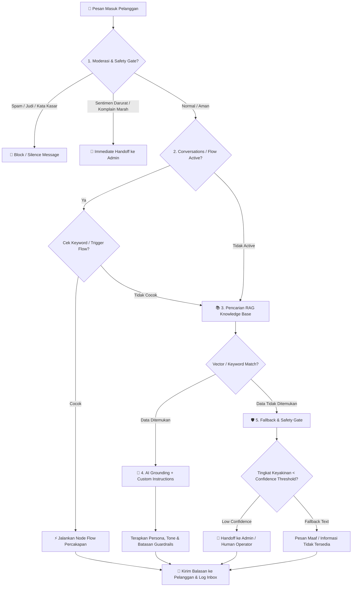

# FLOW SISTEM CHATBOT BALESIN.AI

Dokumen ini menjelaskan alur kerja (*execution flow*) lengkap sistem kecerdasan buatan **Balesin Desk / Balesin.AI**, dari pesan masuk di omnichannel (WhatsApp, Instagram DM, Live Chat) hingga penyusunan balasan berbasis **Flow Automation**, **RAG Knowledge Base**, **Custom Instructions**, dan **Safety Handoff ke Admin**.

---

## 🗺️ Diagram Alur Keputusan Sistem (Mermaid Flowchart)



---

## 📑 Penjelasan Detail Tahapan Sistem

### 1. Pesan Masuk dari Omnichannel (*Inbound Message*)
Pesan diterima dari saluran komunikasi yang terhubung:
* **WhatsApp Cloud API / WhatsApp Gateway**
* **Instagram DM (Meta Webhook)**
* **Website Live Chat Widget**

---

### 2. Moderasi Awal & Safety Gate (*Initial Screening*)
Sebelum diproses oleh AI atau Flow Engine, sistem memfilter pesan secara mendasar:
* **Filter Spam & Judi Online**: Mengabaikan pesan yang terindikasi promosi terlarang atau bot spam.
* **Filter Sentimen Kritis**: Jika terdeteksi ancaman hukum, komplain keras, atau kondisi darurat (*rem blong, kebakaran*), sistem langsung melakukan **Handoff ke Admin** di Unified Inbox.

---

### 3. Prioritas 1: Automation Flow / Conversations (*Visual Flow Builder*)
Sistem memeriksa apakah modul **Conversations (Flow Builder)** diaktifkan.
* **Cek Trigger Keyword**: Sistem mencocokkan teks pesan dengan kata kunci pemicu alur (*trigger keywords*).
* **Jika Trigger Cocok**: Sistem langsung mengambil alih percakapan dan mengeksekusi langkah-langkah interaktif (*Question Node, Option Selection, Quick Reply, Action Node*).
* **Jika Tidak Ada Trigger yang Cocok**: Percakapan diteruskan ke tahap **RAG Knowledge Base Engine**.

---

### 4. Prioritas 2: RAG Knowledge Base Search (*Retrieval-Augmented Generation*)
Jika percakapan tidak ditangani oleh Flow Builder, sistem melakukan pencarian pengetahuan (*hybrid search*) dari basis pengetahuan internal bisnis:
* **FAQ (Tanya Jawab Berulang)**
* **Dokumen Internal (PDF, DOCX, TXT)**
* **Website / URL Scraping**
* **Data Profil Workspace** (Alamat, Jam Operasional, Email Support, Deskripsi Bisnis)

---

### 5. Prioritas 3: RAG Grounding & Custom Instructions
* **Grounding Context**: Informasi bisnis yang ditemukan dimasukkan ke dalam konteks perintah ke AI (*LLM Engine*).
* **Penerapan Custom Instructions**: AI menyusun balasan yang akurat strictly berdasarkan data internal dengan menerapkan:
  * **Persona & Nama Asisten**: Contoh: *Balesin AI Assistant*.
  * **Tone & Sapaan**: *Formal / Santai / Sapaan Kak, Bapak/Ibu, atau Bro*.
  * **Guardrails & Antigenerate**: Melarang AI mengarang harga, melarang memberikan diskon tanpa izin, dan mengarahkan ke admin jika data kurang lengkap.

---

### 6. Prioritas 4: Fallback & Handoff ke Admin (*Safety Gate Takeover*)
Jika informasi yang dicari **tidak ditemukan** di Knowledge Base atau tingkat keyakinan (*confidence score*) di bawah ambang batas (*confidence threshold, misal 80%*):
* AI **tidak akan mengarang jawaban halusinasi**.
* Sistem menjalankan **Fallback**: Mengirimkan pesan sopan bahwa informasi sedang dikoordinasikan.
* Percakapan otomatis ditandai butuh penanganan manusia (*Status: Needs Handoff / Pending Admin*) di **Unified Inbox**.

---

### 7. Pengiriman Respon & Logging Terpadu
* Respon final dikirimkan kembali ke saluran asal pelanggan (*WhatsApp / Instagram / Live Chat*).
* Seluruh log pesan, intent yang terdeteksi, dan status penanganan tercatat secara otomatis di **Unified Inbox** untuk dipantau oleh tim operator.

---

## ⚡ Ringkasan Keputusan Alur (Quick Decision Tree)

```text
User Message Masuk
│
├── 1. Cek Filter Spam / Darurat ──────────► (Jika Spam -> Silence | Jika Darurat -> Handoff Admin)
│
├── 2. Cek Conversations (Flow Builder) ───► Trigger Match? ──► Ya  ──► Jalankan Conversation Flow
│                                                          └── Tidak
│                                                                │
└── 3. RAG Knowledge Base Search ──────────► Data Match? ────► Ya  ──► AI + Custom Instructions
                                                           └── Tidak
                                                                 │
                                                                 └──► Fallback Text & Handoff ke Admin
```

> **Kesimpulan Arsitektur**: **Conversations (Flow Builder)** menjadi prioritas utama untuk alur terstruktur berdasarkan trigger spesifik, sedangkan **Knowledge Base + RAG + Custom Instructions** menjadi mesin AI pintar yang siap menjawab pertanyaan dinamis pelanggan tanpa risiko halusinasi.