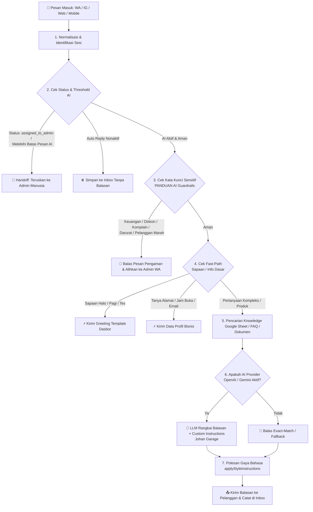

# 🤖 Flow & Alur Kerja Chatbot AI Membalas Pesan (Reply Engine Workflow)

Dokumen ini menjelaskan secara rinci bagaimana sistem arsitektur backend **Balesin AI / Johan Garage** memproses pesan masuk dari pelanggan hingga menghasilkan balasan otomatis yang cerdas, aman, dan sesuai aturan bisnis.

---

## 📊 Diagram Alur Pembalasan Pesan (System Flowchart)

---

## 🛠️ Penjelasan Detail Setiap Tahapan Flow

### 1. Penerimaan & Normalisasi Pesan (Inbound Reception)
* Setiap kali ada chat masuk dari channel integrasi (**WhatsApp Business API**, **Instagram DM/Comment**, atau **Webchat**), sistem menangkap *payload* melalui Webhook.
* Pesan diseragamkan ke dalam format standar sistem (`NormalizedIncomingMessage`) dan dicocokkan dengan riwayat obrolan (*Conversation ID*) yang sudah ada.

### 2. Pengecekan Status Paksa & Kuota AI (Automation & Guardrail Check)
Sebelum AI berpikir, sistem memeriksa aturan pengaman otomatis:
* **Status Handoff Admin (`assigned_to_admin`)**: Jika percakapan sebelumnya sudah dioper ke manusia (karena komplain rumit atau permintaan customer), AI otomatis diam agar tidak mengganggu admin yang sedang menangani.
* **Batas Pesan AI (*AI Message Threshold*)**: Jika jumlah balasan AI dalam satu sesi percakapan sudah melebihi batas yang ditentukan di dasbor (misal default 10 pesan), sistem menganggap obrolan terlalu panjang dan otomatis mengirim pesan pengalihan ke admin.
* **Status Auto-Reply**: Mengecek apakah *toggle* balasan otomatis di channel tersebut sedang dinyalakan atau dimatikan oleh pemilik bisnis.

### 3. Penyaringan Lapisan Pengaman Kritis (Safety & Blacklist Interception)
Sesuai dengan protokol keamanan (**PANDUAN AI**), sistem melakukan penyaringan kata kunci sebelum pesan diproses oleh AI agar tidak terjadi kesalahan fatal:
* **Blacklist & Spam**: Pesan spam atau kata terlarang langsung diabaikan (`[IGNORE]`).
* **Kategori Sensitif (Wajib Eskalasi Manusia)**: Jika pesan mengandung kata kunci terkait:
  1. *Keuangan / Transaksi* (bukti transfer, refund, DP)
  2. *Negosiasi / Diskon Khusus* (minta potong harga)
  3. *Komplain Serius / Garansi*
  4. *Darurat / Keamanan Fisik*
  5. *Pelanggan Marah / Ancaman Viral/Hukum*
  👉 **Tindakan:** Bot langsung merespons dengan kalimat pengaman sopan dan mengarahkan customer ke link WhatsApp Admin Manusia. AI dilarang mengambil keputusan sepihak!

### 4. Respon Cepat Tanpa LLM (Fast-Path & Exact Match)
Untuk menghemat waktu dan kuota token AI, sistem memiliki jalur cepat (*Fast-Path*) untuk pesan-pesan standar:
* **Sapaan Awal (*Greeting*)**: Jika customer hanya mengetik *"Halo"*, *"Hi"*, *"Pagi"*, atau *"Tes"*, sistem langsung mengirimkan teks **Greeting Template** yang diatur di *Chatbot Settings* (misal: *"Halo pren! Selamat datang di Johan Garage..."*).
* **Profil Bisnis Dasar**: Pertanyaan umum seperti *"Alamatnya di mana?"*, *"Buka jam berapa?"*, atau *"Emailnya apa?"* langsung dijawab menggunakan data pasti dari menu *Settings -> Workspace Profile*.

### 5. Pencarian Referensi & Berpikir AI (RAG & LLM Generation)
Jika pertanyaan customer membutuhkan penjelasan produk, keluhan mesin, atau prosedur booking:
* **Retrieval (Pencarian Data)**: Sistem menyapu data di **Google Sheets**, **FAQ**, dan **Dokumen** yang sudah diupload di *Knowledge Base* untuk mencari potong informasi yang paling relevan.
* **LLM Prompting (Otak AI)**: Jika fitur **AI Provider** (OpenAI GPT-4 atau Google Gemini) aktif di dasbor, sistem menggabungkan:
  - **Custom Instructions** (Identitas Persona Johan Garage, Tone of Voice santai anak bengkel, Guardrails).
  - Data profil bisnis & referensi knowledge yang baru ditemukan.
  - Riwayat percakapan sebelumnya.
* Otak AI kemudian merangkai jawaban yang sangat natural, satset, ramah, dan **bebas halusinasi** (tidak mengarang info jika data tidak ada di knowledge).

### 6. Polesan Akhir & Pengiriman (Style Formatting & Dispatch)
* Sebelum dikirim, teks jawaban melewati fungsi penghalus (`applyStyleInstructions`). Fungsi ini memastikan kata sapaan konsisten (misal mengubah *Anda/Saya* menjadi *Om/Bang/Pren* sesuai gaya kasual yang dipilih) dan memotong kalimat jika instruksi meminta jawaban singkat.
* Balasan akhir dikirimkan kembali ke aplikasi pelanggan dalam hitungan detik dan seluruh alur dicatat secara real-time di layar **Live Inbox** dasbor Anda!
